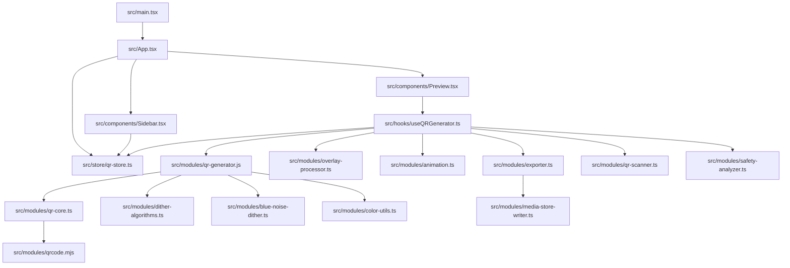
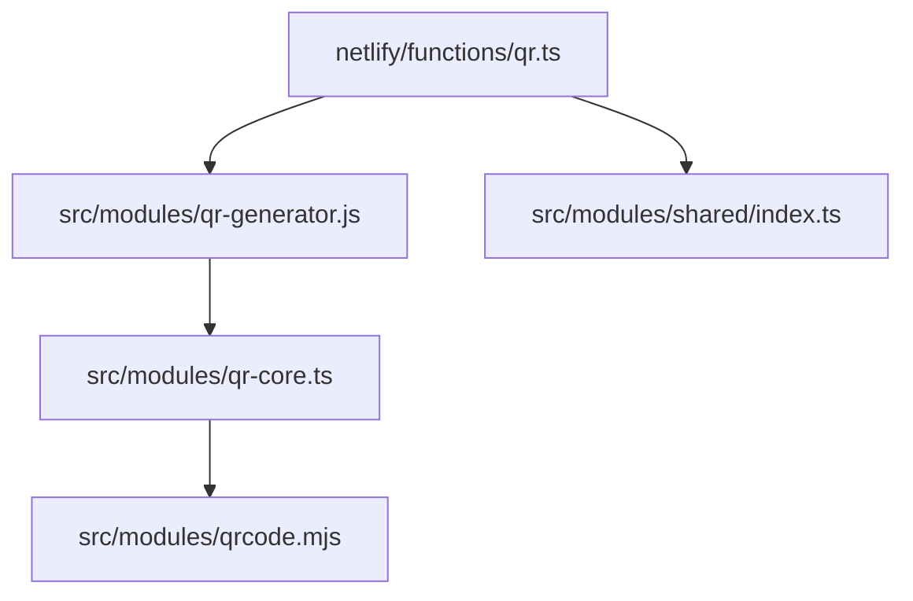
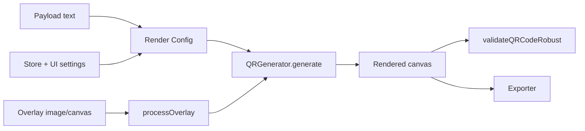

# ANQR Codebase Knowledge (knowledge.md)

Generated: 2026-01-04 (Australia/Melbourne)


## Architecture at a glance

ANQR is a **React + Vite** web app (also wrapped by **Capacitor** for Android) that lets users configure and render QR codes (static or animated) with styling, overlays, watermarks, safety checks, sharing links, and exports.

There are three “execution surfaces” that all reuse the same core renderer:

1. **Web / Capacitor app**: interactive editor UI builds a config from state and renders into a `<canvas>`.
2. **Netlify Function (`netlify/functions/qr.ts`)**: server-side image generator used for `https://anqr.link/?...` style embed URLs (e.g. ``).
3. **Android native plugin**: a Capacitor plugin used to write files to the device’s Documents folder (MediaStore).

Key design idea: a single “QR render config object” is assembled from UI state, then passed into `src/modules/qr-generator.js` to produce a canvas (and optionally matrix data for vector export).

## Core runtime flow (web)



### Step-by-step (editor)

1. **Boot** (`src/main.tsx`)
   - Creates the React root.
   - Wraps the app in providers (i18n, tooltips, error boundary).
2. **App controller** (`src/App.tsx`)
   - Chooses between “editor” vs static pages.
   - Parses URL params (`parseUrlParams`) to pre-load editor settings.
3. **State** (`src/store/qr-store.ts`)
   - Single Zustand store holds *all* editor settings: payload, encoding, render style, overlay, watermark, animation, output, safety, metadata, ads/QA, etc.
4. **UI** (components + sections)
   - Sidebar sections update slices of the store (e.g. Render / Overlay / Watermark).
   - Preview consumes the store and the generator hook to show render output + warnings.
5. **Generate** (`src/hooks/useQRGenerator.ts`)
   - Subscribes to store slices.
   - Builds a **debounced** generator config object.
   - Loads overlay images (static or animated), preprocesses them, and calls:
     - `qrGenerator.generate(config, overlayCanvas?)`
   - Copies the generated canvas into a visible canvas element.
   - Optionally validates by scanning the output canvas (`validateQRCodeRobust`).
6. **Export/share**
   - Export uses `src/modules/exporter.ts` (PNG/WebP/JPEG/GIF/SVG/vector SVG).
   - Sharing uses `src/modules/share-utils.ts` (URL params + embed snippets).

## Core runtime flow (server / embed)

The Netlify function takes **query parameters**, maps them to the same render config used by the app, generates on a Node canvas (`@napi-rs/canvas`), and returns an image response.



Important implication: **URL parameter compatibility** is enforced in two places:
- Client share encoder/decoder (`src/modules/share-utils.ts`)
- Server query parser (`netlify/functions/qr.ts`)

If either side adds options without the other being updated, you can get subtle “web looks different from  embed” mismatches.

## State model (how the UI maps to generation)

The store is intentionally “section-shaped”:

- `payload` → what data is encoded (URL/text/WiFi/payment/etc).
- `qr` → QR spec: version, encoding mode, ECC, mask, quiet zone, etc.
- `render` → visual style: module size, styles, gaps, finder/timing/alignment, gradients, per-module color, etc.
- `overlay` → overlay image selection, crop/fit, blend mode, dithering, transforms.
- `watermark` → optional watermark pattern/text and placement.
- `animation` → source frames + playback parameters for animated output.
- `safety` + `auto` → auto ECC choices + enforcement (min module/quiet zone, overlay intensity caps, contrast warnings).
- `output` + `metadata` → export format, dimensions, DPI, embedded metadata.

The renderer config assembled in `useQRGenerator.ts` is effectively the *canonical mapping* from those slices to the actual generation engine.

## Render pipeline (what actually happens)

At a high-level, the pipeline is:



Where:
- `Payload text` comes from `qr-store.ts` via `getPayloadText()` and `payload-generators.ts`.
- Overlay preprocessing is in `overlay-processor.ts` (+ `image-filters.ts` / dithering helpers).
- Rendering + styling + compositing is `qr-generator.js` (backed by `qr-core.ts` and vendor QR matrix logic).
- Validation is `qr-scanner.ts` (decode/scan check).
- Export is `exporter.ts` (plus native file writing if running on mobile).

## URL parameter parity (client share encoder vs server image function)

The **client** (`src/modules/share-utils.ts`) can generate URLs with **163** query keys.

The **server** (`netlify/functions/qr.ts`) currently reads **110** query keys.

That means **57** keys that the client may emit are not read by the server, so they will be ignored in `` embeds unless you add server-side support.

### Keys emitted by client but not read by server (57)

```text
autoEcc, autoReduce, autoVer, bgOver, bounce, colorCycle, cropEn, cropSize, cropX, cropY, fmtExtra, fname, gifDelays, gifDisp, gifDispH, gifDispW, gifFps, gifPalette, gifQuant, gifScale, lockA, lockAll, lockF, lockT, lockV, loop, maxF, metaKv, metaLic, metaTime, ovFramePick, ovType, qaBlur, qaContrast, qaHeatmap, qaScans, qaStrict, qaWarn, reduce, reduceStyle, rseed, safeEdges, safeMinModule, safeMinQZ, safeOverlay, safeOverlayMax, safeScan, safeWarn, scanEvery, subGrid, subMode, trace, wmt, wmtH, wmtW
```

### Keys read by server but not emitted by client (4)

```text
maxOverlayIntensityH, maxOverlayIntensityL, maxOverlayIntensityM, maxOverlayIntensityQ
```

Recommended workflow:
- Treat `share-utils.ts` as the canonical list of public query params.
- Add a small unit test (or script) that parses both files and fails CI if the sets diverge.

## Supporting (non-73) files worth knowing about

These are not in the “73 code files” list you provided, but they materially affect runtime:

- `netlify/functions/qr.ts` — server-side renderer for embed URLs (`anqr.link/?...`).
- `src/modules/shared/index.ts` — pure utilities intended to be shared client/server.
- `android/app/src/main/java/link/anqr/app/MediaStoreWriterPlugin.java` — native file writer for Android via Capacitor.
- `android/app/src/main/java/link/anqr/app/MainActivity.java` — Android bootstrap.
- `vite.config.ts`, `capacitor.config.ts`, `netlify.toml`, `Makefile` — build/runtime configuration.

This document references them when needed.

## Subsystem deep dives

### 1) UI: editor shell + sections

- `src/App.tsx` orchestrates:
  - URL param ingest (`parseUrlParams`) → store update
  - screen routing (editor vs gallery/static pages)
  - layout state (sidebar open, mode/tier selection)
- `src/components/Header.tsx` provides navigation + “level” selection (basic/advanced/pro).
- `src/components/Sidebar.tsx` is the settings host:
  - Each accordion section maps to one “slice” of the store:
    - Payload → `payload`
    - QR encoding → `qr`
    - Render → `render`
    - Overlay → `overlay`
    - Watermark → `watermark`
    - Animation → `animation`
    - Safety → `safety` (+ `auto`)
    - Output → `output`
    - Metadata → `metadata`
    - Share → uses `share-utils`
- `src/components/Preview.tsx` is the output surface:
  - Holds the visible `<canvas>`
  - Shows warnings (contrast, overlay intensity, quiet zone)
  - Offers quick preview toggles and validation status

### 2) State: `src/store/qr-store.ts`

Zustand store provides:
- **Types** for all settings (enums/unions used across UI and renderer)
- **Initial defaults** (the default “look” of the generator)
- **Actions** to update slices (usually shallow merges for section-local updates)
- **Derived helpers** like “build payload string” (via `payload-generators.ts`)
- **QA / telemetry toggles** (e.g. debug heatmaps, blur/contrast checks)

In practice:
- UI code should *only* read/write the store.
- Rendering code should not depend on UI components; it depends on store + pure modules.

### 3) Generation: `src/hooks/useQRGenerator.ts`

This is the “engine room” of the app.
It:
- reads store slices
- computes `safetyAdjustedConfig` and the final `debouncedConfig`
- loads/prepares overlay canvases
- manages animation playback state + derived frames
- calls the generator and pushes results into:
  - `canvas` (for display/export)
  - `qrMatrix` (for vector SVG export)

It also performs:
- **Validation scan** of the generated canvas (skipped while animating for perf)
- **Ad gating hooks** (interstitials/banner via `admob-service.ts`)
- **Export** orchestration via `exporter.ts`

### 4) Rendering core: `src/modules/qr-generator.js`

`QRGenerator`:
- computes QR matrix (via `qr-core.ts` + vendor lib)
- identifies structural modules (finder/timing/alignment/format/version)
- draws modules with style options (shapes, corners, eye styles, gaps)
- supports gradients and per-module color logic
- applies overlay constraints (skip/lock certain regions; blend)
- supports dithering / blue-noise decisions for overlays and style effects
- maintains memoization caches to keep the editor responsive

The generator keeps the last matrix for vector export (`getLastMatrix()`).

### 5) Overlay and image preprocessing: `src/modules/overlay-processor.ts`

Responsibilities:
- load images from file or URL into a canvas
- resize/crop according to fit mode
- apply transforms (rotate/flip/scale)
- apply filters (brightness/contrast/gamma/blur/threshold/edge/etc) via `image-filters.ts`
- apply dithering defaults (especially mobile-friendly presets)
- provide helpers (rotateCanvas, loadImageFromUrl, etc)

### 6) Animation: `src/modules/animation.ts` + `src/modules/temporal-dither.ts`

- Detects and parses animated sources (GIF, APNG, animated WebP where supported).
- Converts frames into canvases / pixel buffers.
- Provides frame timing and playback helpers.
- Temporal dithering can be used to reduce banding/flicker across frames in animated output.

### 7) Safety + validation: `src/modules/safety-analyzer.ts` + `src/modules/qr-scanner.ts`

- **Safety analyzer** evaluates config risks:
  - quiet zone violations
  - module size too small
  - overlay intensity too high / too destructive
  - low contrast
- **QR scanner** decodes the rendered canvas and compares result to intended content.
  - used as a regression guard: “the pretty QR still scans”

### 8) Export: `src/modules/exporter.ts` + `src/modules/media-store-writer.ts`

Exports:
- Raster: PNG / JPEG / WebP
- Animated: GIF (with quantization/dither settings)
- Vector: SVG (and “vector SVG” built from module matrix)

Also:
- embeds metadata (optional)
- writes to disk in browser (download) or Android Documents (MediaStore plugin)

### 9) Sharing: `src/modules/share-utils.ts`

- Canonical encoder/decoder for URL parameters.
- Generates “embed code” and social share URLs.
- Updates the browser URL without full reload (`updateBrowserUrl`).
- Also acts as the **public contract** for which settings are shareable.

---

# Per-file reference (73 code-related files)

Each entry includes:
- exports
- internal imports
- internal “used by”
- notes where relevant


### `src/App.tsx`
**Exports**
```
default
```
**Imports (internal)**
- src/components/BusyOverlay.tsx
- src/components/Gallery.tsx
- src/components/Header.tsx
- src/components/Preview.tsx
- src/components/Sidebar.tsx
- src/components/StaticPage.tsx
- src/components/ui/tooltip.tsx
- src/data/gallery-items.ts
- src/hooks/useBannerHeight.ts
- src/hooks/useQRGenerator.ts
- src/i18n/index.ts
- src/modules/share-utils.ts
- src/store/qr-store.ts
**Used by (internal)**
- src/main.tsx

### `src/components/AdPlaceholder.tsx`
AdSense Component
Displays Google AdSense ads with proper configuration
**Exports**
```
AdPlaceholder
AdSense
default
```
**Imports (internal)**
_(none)_
**Used by (internal)**
- src/components/AdUnit.tsx

### `src/components/AdUnit.tsx`
Ad Unit
Renders an AdSense <ins> tag when a valid ad slot ID is available.
Falls back to a lightweight placeholder during development, preview
builds, or when slot IDs have not been configured yet.
**Exports**
```
AdUnit
AdUnitProps
default
```
**Imports (internal)**
- src/components/AdPlaceholder.tsx
**Used by (internal)**
- src/components/Gallery.tsx
- src/components/Preview.tsx
- src/components/Sidebar.tsx
- src/components/StaticPage.tsx

### `src/components/BusyOverlay.tsx`
BusyOverlay Component
Modern, minimal visual busy indicator for long-running operations.
No text - pure CSS animation. Always appears fullscreen centered.
**Exports**
```
BusyOverlay
default
```
**Imports (internal)**
_(none)_
**Used by (internal)**
- src/App.tsx
- src/components/Preview.tsx

### `src/components/ErrorBoundary.tsx`
Error Boundary Component
Catches JavaScript errors anywhere in the child component tree,
logs them, and displays a fallback UI instead of crashing the app.
**Exports**
```
ErrorBoundary
default
```
**Imports (internal)**
- src/components/ui/button.tsx
**Used by (internal)**
- src/main.tsx

### `src/components/Gallery.tsx`
Gallery Component
Hero-style gallery showcasing ANQR features organized by category
**Exports**
```
Gallery
default
```
**Imports (internal)**
- src/components/AdUnit.tsx
- src/data/gallery-items.ts
- src/modules/admob-service.ts
**Used by (internal)**
- src/App.tsx

### `src/components/Header.tsx`
**Exports**
```
Header
```
**Imports (internal)**
- src/components/StaticPage.tsx
- src/components/ui/button.tsx
- src/components/ui/select.tsx
- src/components/ui/tabs.tsx
- src/data/gallery-items.ts
- src/hooks/useBannerHeight.ts
- src/i18n/index.ts
- src/modules/admob-service.ts
- src/modules/share-utils.ts
- src/store/qr-store.ts
**Used by (internal)**
- src/App.tsx

### `src/components/Preview.tsx`
**Exports**
```
Preview
```
**Imports (internal)**
- src/components/AdUnit.tsx
- src/components/BusyOverlay.tsx
- src/hooks/useQRGenerator.ts
- src/modules/color-utils.ts
- src/modules/safety-analyzer.ts
- src/store/qr-store.ts
**Used by (internal)**
- src/App.tsx

### `src/components/Sidebar.tsx`
**Exports**
```
Sidebar
```
**Imports (internal)**
- src/components/AdUnit.tsx
- src/components/sections/AnimationSection.tsx
- src/components/sections/MetadataSection.tsx
- src/components/sections/OutputSection.tsx
- src/components/sections/OverlaySection.tsx
- src/components/sections/PayloadSection.tsx
- src/components/sections/QREncodingSection.tsx
- src/components/sections/RenderSection.tsx
- src/components/sections/SafetySection.tsx
- src/components/sections/ShareSection.tsx
- src/components/sections/WatermarkSection.tsx
- src/components/ui/accordion.tsx
- src/lib/search-context.tsx
- src/store/qr-store.ts
**Used by (internal)**
- src/App.tsx

### `src/components/StaticPage.tsx`
StaticPage
About, Privacy, Terms, Contact, and Guide pages.
**Exports**
```
StaticPage
StaticPageType
default
```
**Imports (internal)**
- src/components/AdUnit.tsx
- src/components/ui/button.tsx
**Used by (internal)**
- src/App.tsx
- src/components/Header.tsx

### `src/components/sections/AnimationSection.tsx`
**Exports**
```
AnimationSection
```
**Imports (internal)**
- src/components/ui/input.tsx
- src/components/ui/label.tsx
- src/components/ui/select.tsx
- src/components/ui/slider.tsx
- src/components/ui/switch.tsx
- src/lib/search-context.tsx
- src/store/qr-store.ts
**Used by (internal)**
- src/components/Sidebar.tsx

### `src/components/sections/MetadataSection.tsx`
**Exports**
```
MetadataSection
```
**Imports (internal)**
- src/components/ui/button.tsx
- src/components/ui/input.tsx
- src/components/ui/label.tsx
- src/components/ui/switch.tsx
- src/components/ui/textarea.tsx
- src/lib/search-context.tsx
- src/store/qr-store.ts
**Used by (internal)**
- src/components/Sidebar.tsx

### `src/components/sections/OutputSection.tsx`
**Exports**
```
OutputSection
```
**Imports (internal)**
- src/components/ui/input.tsx
- src/components/ui/label.tsx
- src/components/ui/select.tsx
- src/components/ui/slider.tsx
- src/components/ui/switch.tsx
- src/lib/search-context.tsx
- src/store/qr-store.ts
**Used by (internal)**
- src/components/Sidebar.tsx

### `src/components/sections/OverlaySection.tsx`
**Exports**
```
OverlaySection
```
**Imports (internal)**
- src/components/ui/button.tsx
- src/components/ui/input.tsx
- src/components/ui/label.tsx
- src/components/ui/select.tsx
- src/components/ui/slider.tsx
- src/components/ui/switch.tsx
- src/lib/search-context.tsx
- src/store/qr-store.ts
**Used by (internal)**
- src/components/Sidebar.tsx

### `src/components/sections/PayloadSection.tsx`
**Exports**
```
PayloadSection
```
**Imports (internal)**
- src/components/ui/input.tsx
- src/components/ui/label.tsx
- src/components/ui/select.tsx
- src/components/ui/switch.tsx
- src/components/ui/textarea.tsx
- src/i18n/index.ts
- src/lib/search-context.tsx
- src/modules/payload-generators.ts
- src/store/qr-store.ts
**Used by (internal)**
- src/components/Sidebar.tsx

### `src/components/sections/QREncodingSection.tsx`
**Exports**
```
QREncodingSection
```
**Imports (internal)**
- src/components/ui/label.tsx
- src/components/ui/select.tsx
- src/components/ui/slider.tsx
- src/components/ui/switch.tsx
- src/lib/search-context.tsx
- src/modules/qr-core.ts
- src/store/qr-store.ts
**Used by (internal)**
- src/components/Sidebar.tsx

### `src/components/sections/RenderSection.tsx`
**Exports**
```
RenderSection
```
**Imports (internal)**
- src/components/ui/button.tsx
- src/components/ui/input.tsx
- src/components/ui/label.tsx
- src/components/ui/select.tsx
- src/components/ui/slider.tsx
- src/components/ui/switch.tsx
- src/lib/search-context.tsx
- src/store/qr-store.ts
**Used by (internal)**
- src/components/Sidebar.tsx

### `src/components/sections/SafetySection.tsx`
**Exports**
```
SafetySection
```
**Imports (internal)**
- src/components/ui/label.tsx
- src/components/ui/select.tsx
- src/components/ui/slider.tsx
- src/components/ui/switch.tsx
- src/lib/search-context.tsx
- src/store/qr-store.ts
**Used by (internal)**
- src/components/Sidebar.tsx

### `src/components/sections/ShareSection.tsx`
**Exports**
```
ShareSection
```
**Imports (internal)**
- src/components/ui/button.tsx
- src/components/ui/input.tsx
- src/components/ui/label.tsx
- src/components/ui/switch.tsx
- src/lib/search-context.tsx
- src/modules/share-utils.ts
- src/store/qr-store.ts
**Used by (internal)**
- src/components/Sidebar.tsx

### `src/components/sections/WatermarkSection.tsx`
**Exports**
```
WatermarkSection
```
**Imports (internal)**
- src/components/ui/button.tsx
- src/components/ui/input.tsx
- src/components/ui/label.tsx
- src/components/ui/select.tsx
- src/components/ui/slider.tsx
- src/components/ui/switch.tsx
- src/lib/search-context.tsx
- src/store/qr-store.ts
**Used by (internal)**
- src/components/Sidebar.tsx

### `src/components/ui/accordion.tsx`
**Exports**
```
Accordion
AccordionContent
AccordionItem
AccordionTrigger
```
**Imports (internal)**
- src/lib/utils.ts
**Used by (internal)**
- src/components/Sidebar.tsx

### `src/components/ui/button.tsx`
**Exports**
```
Button
ButtonProps
buttonVariants
```
**Imports (internal)**
- src/lib/utils.ts
**Used by (internal)**
- src/components/ErrorBoundary.tsx
- src/components/Header.tsx
- src/components/StaticPage.tsx
- src/components/sections/MetadataSection.tsx
- src/components/sections/OverlaySection.tsx
- src/components/sections/RenderSection.tsx
- src/components/sections/ShareSection.tsx
- src/components/sections/WatermarkSection.tsx

### `src/components/ui/input.tsx`
**Exports**
```
Input
InputProps
```
**Imports (internal)**
- src/lib/utils.ts
**Used by (internal)**
- src/components/sections/AnimationSection.tsx
- src/components/sections/MetadataSection.tsx
- src/components/sections/OutputSection.tsx
- src/components/sections/OverlaySection.tsx
- src/components/sections/PayloadSection.tsx
- src/components/sections/RenderSection.tsx
- src/components/sections/ShareSection.tsx
- src/components/sections/WatermarkSection.tsx

### `src/components/ui/label.tsx`
**Exports**
```
Label
```
**Imports (internal)**
- src/lib/utils.ts
**Used by (internal)**
- src/components/sections/AnimationSection.tsx
- src/components/sections/MetadataSection.tsx
- src/components/sections/OutputSection.tsx
- src/components/sections/OverlaySection.tsx
- src/components/sections/PayloadSection.tsx
- src/components/sections/QREncodingSection.tsx
- src/components/sections/RenderSection.tsx
- src/components/sections/SafetySection.tsx
- src/components/sections/ShareSection.tsx
- src/components/sections/WatermarkSection.tsx

### `src/components/ui/select.tsx`
**Exports**
```
Select
SelectContent
SelectGroup
SelectItem
SelectLabel
SelectScrollDownButton
SelectScrollUpButton
SelectSeparator
SelectTrigger
SelectValue
```
**Imports (internal)**
- src/lib/utils.ts
**Used by (internal)**
- src/components/Header.tsx
- src/components/sections/AnimationSection.tsx
- src/components/sections/OutputSection.tsx
- src/components/sections/OverlaySection.tsx
- src/components/sections/PayloadSection.tsx
- src/components/sections/QREncodingSection.tsx
- src/components/sections/RenderSection.tsx
- src/components/sections/SafetySection.tsx
- src/components/sections/WatermarkSection.tsx

### `src/components/ui/slider.tsx`
**Exports**
```
Slider
```
**Imports (internal)**
- src/lib/utils.ts
**Used by (internal)**
- src/components/sections/AnimationSection.tsx
- src/components/sections/OutputSection.tsx
- src/components/sections/OverlaySection.tsx
- src/components/sections/QREncodingSection.tsx
- src/components/sections/RenderSection.tsx
- src/components/sections/SafetySection.tsx
- src/components/sections/WatermarkSection.tsx

### `src/components/ui/switch.tsx`
**Exports**
```
Switch
```
**Imports (internal)**
- src/lib/utils.ts
**Used by (internal)**
- src/components/sections/AnimationSection.tsx
- src/components/sections/MetadataSection.tsx
- src/components/sections/OutputSection.tsx
- src/components/sections/OverlaySection.tsx
- src/components/sections/PayloadSection.tsx
- src/components/sections/QREncodingSection.tsx
- src/components/sections/RenderSection.tsx
- src/components/sections/SafetySection.tsx
- src/components/sections/ShareSection.tsx
- src/components/sections/WatermarkSection.tsx

### `src/components/ui/tabs.tsx`
**Exports**
```
Tabs
TabsContent
TabsList
TabsTrigger
```
**Imports (internal)**
- src/lib/utils.ts
**Used by (internal)**
- src/components/Header.tsx

### `src/components/ui/textarea.tsx`
**Exports**
```
Textarea
TextareaProps
```
**Imports (internal)**
- src/lib/utils.ts
**Used by (internal)**
- src/components/sections/MetadataSection.tsx
- src/components/sections/PayloadSection.tsx

### `src/components/ui/tooltip.tsx`
**Exports**
```
Tooltip
TooltipContent
TooltipProvider
TooltipTrigger
```
**Imports (internal)**
- src/lib/utils.ts
**Used by (internal)**
- src/App.tsx

### `src/data/gallery-items.ts`
Gallery Items - Comprehensive feature showcase for ANQR
Organized by feature category to help users understand visual differences:
- Plain QR: No overlay, different styles/colors/ECC
- Image Overlays: tsunami.jpg with different modes
- Animated Overlays: king.gif with different modes
- Blend Modes: Different overlay blend modes
**Exports**
```
GALLERY_IMAGE_PATH
GalleryCategory
GalleryItem
GallerySection
buildGalleryUrl
galleryItems
gallerySections
getGalleryBaseUrl
getGalleryImagePath
```
**Imports (internal)**
_(none)_
**Used by (internal)**
- src/App.tsx
- src/components/Gallery.tsx
- src/components/Header.tsx

### `src/hooks/useBannerHeight.ts`
**Exports**
```
useBannerHeight
```
**Imports (internal)**
- src/modules/admob-service.ts
**Used by (internal)**
- src/App.tsx
- src/components/Header.tsx

### `src/hooks/useQRGenerator.ts`
useQRGenerator Hook
Wires the QR store state to the QRGenerator module for live rendering
Supports animated GIF overlays
**Exports**
```
default
useQRGenerator
```
**Imports (internal)**
- src/modules/admob-service.ts
- src/modules/animation-patterns.ts
- src/modules/animation.ts
- src/modules/exporter.ts
- src/modules/overlay-processor.ts
- src/modules/qr-generator.js
- src/modules/qr-scanner.ts
- src/modules/temporal-dither.ts
- src/modules/watermark.ts
- src/store/qr-store.ts
**Used by (internal)**
- src/App.tsx
- src/components/Preview.tsx

### `src/i18n/index.ts`
i18n Configuration
Internationalization setup using react-i18next
Uses Google Play language codes for compatibility
OPTIMIZATION: Only English is bundled. Other locales are lazy-loaded on demand.
**Exports**
```
LanguageCode
default
isRtlLanguage
languages
loadLocale
```
**Imports (internal)**
_(none)_
**Used by (internal)**
- src/App.tsx
- src/components/Header.tsx
- src/components/sections/PayloadSection.tsx
- src/main.tsx

### `src/lib/search-context.tsx`
**Exports**
```
HighlightedLabel
SearchProvider
highlightText
useSearch
```
**Imports (internal)**
_(none)_
**Used by (internal)**
- src/components/Sidebar.tsx
- src/components/sections/AnimationSection.tsx
- src/components/sections/MetadataSection.tsx
- src/components/sections/OutputSection.tsx
- src/components/sections/OverlaySection.tsx
- src/components/sections/PayloadSection.tsx
- src/components/sections/QREncodingSection.tsx
- src/components/sections/RenderSection.tsx
- src/components/sections/SafetySection.tsx
- src/components/sections/ShareSection.tsx
- src/components/sections/WatermarkSection.tsx

### `src/lib/utils.ts`
**Exports**
```
cn
```
**Imports (internal)**
_(none)_
**Used by (internal)**
- src/components/ui/accordion.tsx
- src/components/ui/button.tsx
- src/components/ui/input.tsx
- src/components/ui/label.tsx
- src/components/ui/select.tsx
- src/components/ui/slider.tsx
- src/components/ui/switch.tsx
- src/components/ui/tabs.tsx
- src/components/ui/textarea.tsx
- src/components/ui/tooltip.tsx

### `src/main.tsx`
**Imports (internal)**
- src/App.tsx
- src/components/ErrorBoundary.tsx
- src/i18n/index.ts
- src/modules/admob-service.ts
**Used by (internal)**
_(none)_
**Notes**
- Not imported by other app code (may be unused, experimental, or referenced dynamically).

### `src/modules/admob-service.ts`
AdMob Service
Handles AdMob ads for native Android/iOS apps via Capacitor.
Supports: Banner ads, Interstitial ads, Rewarded interstitial ads
This service is only used when running in a native app context.
**Exports**
```
InterstitialType
RewardedType
getBannerHeight
getCurrentBannerPosition
getGenerationCount
hideBannerAd
initializeAdMob
isAdMobAvailable
isRewardedAdReady
onBannerHeightChange
prepareAllAds
prepareInterstitial
prepareRewardedAd
removeBannerAd
resetGenerationCount
showBannerAd
showBottomBanner
showInterstitial
showRewardedAd
showTopBanner
trackGenerationAndShowAd
```
**Imports (internal)**
_(none)_
**Used by (internal)**
- src/components/Gallery.tsx
- src/components/Header.tsx
- src/hooks/useBannerHeight.ts
- src/hooks/useQRGenerator.ts
- src/main.tsx

### `src/modules/animation-patterns.ts`
Animation Patterns Module
Generates animated QR code effects from static images
**Exports**
```
AnimationPattern
InterpolationMode
default
generatePatternFrames
interpolateFrames
```
**Imports (internal)**
- src/modules/color-utils.ts
**Used by (internal)**
- src/hooks/useQRGenerator.ts

### `src/modules/animation.ts`
Animation Module
Handles GIF and WebP animation parsing, frame management, animation patterns, and temporal effects
Performance optimizations:
- Canvas pooling to reduce GC pressure
- Frame decimation based on target FPS
- Reusable composite canvas for GIF parsing
**Exports**
```
Animation
AnimationFrame
AnimationOptions
AnimationPattern
AnimationState
GifCompositor
advanceAnimation
applyAnimationPattern
applyColorCycle
applyTemporalDither
calculateCompositorFps
calculateSourceFps
createAnimationLoop
createAnimationState
createGifCompositor
decimateCompositorFrames
decimateFramesToFps
default
detectImageFormat
getGifDelays
getNextFrame
interpolateFrames
isAnimatedWebP
parseAnimatedImage
parseGifFrames
parseWebPFrames
```
**Imports (internal)**
- src/modules/color-utils.ts
**Used by (internal)**
- src/hooks/useQRGenerator.ts

### `src/modules/blue-noise-dither.ts`
Blue Noise Dithering Module for QR Codes
Uses blue noise thresholding instead of Floyd-Steinberg error diffusion.
Follows the same structure as generate.ts to preserve QR scannability:
- Data points (center of each module) MUST preserve QR values
- Only "free points" (non-locked, non-data) can be dithered
- Blue noise provides better visual quality than ordered dithering
**Exports**
```
BlueNoiseOptions
BlueNoiseResult
CanvasFactory
ColorMode
RGB
defaultBrowserCanvasFactory
generateBlueNoiseDithered
```
**Imports (internal)**
- src/modules/qrcode.mjs
**Used by (internal)**
- src/modules/qr-generator.js

### `src/modules/color-utils.ts`
Color Utilities Module
Provides color parsing, blending, gradients, and contrast checking
**Exports**
```
ColorUtils
GradientConfig
HSL
HSLA
RGB
RGBA
adjustForContrast
alphaBlend
blendColors
blendRgb
createCssGradient
createSeededRandom
default
getAnalogous
getComplementary
getContrastRatio
getGradientColor
getGradientColorAt
getRelativeLuminance
getTextColor
getTriadic
hslToRgb
isDark
meetsContrastAA
meetsContrastAAA
multiplyBlend
overlayBlend
parseColor
parseHex
parseHexAlpha
parseHslString
parseRgbString
rgbToGray
rgbToHex
rgbToHsl
rgbToString
rgbaToHex
rgbaToString
screenBlend
seededRandom
```
**Imports (internal)**
- src/store/qr-store.ts
**Used by (internal)**
- src/components/Preview.tsx
- src/modules/animation-patterns.ts
- src/modules/animation.ts
- src/modules/qr-generator.js
- src/modules/safety-analyzer.ts

### `src/modules/crop-handler.js`
CropHandler - Manages a draggable/resizable square crop overlay
for selecting regions from non-square images
**Exports**
```
CropHandler
```
**Imports (internal)**
_(none)_
**Used by (internal)**
_(none)_
**Notes**
- Not imported by other app code (may be unused, experimental, or referenced dynamically).

### `src/modules/dither-algorithms.ts`
Dithering Algorithms Module
Comprehensive implementation of all dithering algorithms
Supports error diffusion, ordered dithering, and noise-based methods
**Exports**
```
DitherAlgorithms
DitherOptions
DitherResult
RGB
adaptiveThresholdDither
applyDither
bayerDither
blueNoiseDither
blueNoiseErrorDiffusion
default
edgeAwareDither
errorDiffusion
gaussianNoiseDither
imageDataToFloat
orderedDither
perceptualDither
screenedBlueNoiseDither
temporalBlueNoiseDither
triangularNoiseDither
whiteNoiseDither
```
**Imports (internal)**
- src/store/qr-store.ts
**Used by (internal)**
- src/modules/overlay-processor.ts
- src/modules/qr-generator.js

### `src/modules/exporter.ts`
Exporter Module
Handles PNG, WebP, GIF, and SVG export with full color support
Uses gifenc npm package for high-quality GIF encoding
Supports native file saving on Android/iOS via Capacitor
**Exports**
```
ExportConfig
ExportResult
Exporter
ExporterModule
OutputFormat
PngMetadata
VectorAlignmentStyle
VectorFinderStyle
VectorModuleStyle
VectorSvgConfig
VectorTimingStyle
canvasToBlob
default
downloadGif
downloadImage
downloadSvg
downloadUrl
downloadVectorSvg
exportGif
exportImage
exportSvg
exportVectorSvg
```
**Imports (internal)**
- src/modules/media-store-writer.ts
**Used by (internal)**
- src/hooks/useQRGenerator.ts

### `src/modules/image-filters.ts`
Image Filters Module
Provides all image processing filters for overlay preprocessing
Works with Canvas ImageData for real-time processing
Note: Some utility functions (rgbToGray, hslToRgb, rgbToHsl) are also
exported from color-utils.ts for consistency. This module keeps its own
optimized implementations for tight inner loops.
**Exports**
```
FilterOptions
HSL
ImageFilters
RGB
RGBA
applyColorMode
applyFilters
blur
brightness
cannyEdge
clamp
clamp01
contrast
convolve
copyImageData
default
duotone
emboss
gamma
gaussianBlur
getBrightnessMap
getRGBMap
grayscale
hslToRgb
hueRotate
invert
posterize
rgbToGray
rgbToHsl
saturation
sharpen
sobelEdge
threshold
```
**Imports (internal)**
- src/store/qr-store.ts
**Used by (internal)**
- src/modules/overlay-processor.ts

### `src/modules/index.ts`
ANQR Modules Index
Consolidated exports for all QR code generation functionality
organized by feature section from anqr-features.txt
**Exports**
```
//
Animation
AnimationDefault
ColorUtils
ColorUtilsDefault
CropHandler
DitherAlgorithms
DitherAlgorithmsDefault
Exporter
ExporterDefault
ExporterModule
ImageFilters
ImageFiltersDefault
OverlayProcessor
OverlayProcessorDefault
PayloadGenerators
PayloadGeneratorsDefault
QRCore
QRCoreDefault
QRGenerator
QRScanner
QRScannerDefault
SafetyAnalyzer
SafetyAnalyzerDefault
ShareUtils
ShareUtilsDefault
Watermark
WatermarkDefault
adjustForContrast
advanceAnimation
alphaBlend
analyzeContrast
analyzeMatrixContrast
analyzeQR
applyAnimationPattern
applyBlendMode
applyBlurSimulation
applyCenterLogo
applyColorCycle
applyColorMode
applyDither
applyFilters
applyNoiseSimulation
applyOverlayMode
applyTemporalDither
applyWatermark
bayerDither
blendColors
blendRgb
blueNoiseDither
blur
brightness
buildUrlParams
calculateCompositorFps
calculateOptimalVersion
calculateSafeIntensity
cannyEdge
canvasToBlob
canvasToDataUrl
clamp
… (139 more)
```
**Imports (internal)**
- src/modules/qr-generator.js
**Used by (internal)**
_(none)_
**Notes**
- Not imported by other app code (may be unused, experimental, or referenced dynamically).

### `src/modules/media-store-writer.ts`
**Exports**
```
MediaStoreWriter
MediaStoreWriterPlugin
saveBase64ToDocuments
```
**Imports (internal)**
_(none)_
**Used by (internal)**
- src/modules/exporter.ts

### `src/modules/overlay-processor.ts`
Overlay Processor Module
Handles image loading, cropping, filter application, and blend modes
Optimizations:
- Caches processed overlay data for repeated access
- Mobile detection for automatic performance tuning
**Exports**
```
DEFAULT_MOBILE_DITHER
OverlayDitherOptions
OverlayOptions
OverlayProcessor
ProcessedOverlay
STORE_DEFAULT_DITHER
applyOverlayMode
cropImage
default
ditherOverlay
ditherOverlayForQR
fitImage
flipCanvas
getEffectiveDitherKind
getOverlayData
getOverlayRGBData
loadImageFromDataUrl
loadImageFromFile
loadImageFromUrl
processOverlay
rotateCanvas
```
**Imports (internal)**
- src/modules/dither-algorithms.ts
- src/modules/image-filters.ts
- src/store/qr-store.ts
**Used by (internal)**
- src/hooks/useQRGenerator.ts

### `src/modules/payload-generators.ts`
Payload Generators Module
Generates properly formatted strings for all QR payload types
Implements EMVCo QR Code Specification for Merchant-Presented Mode
Supports EPC/SEPA, UPI, Swiss QR-bill, and cryptocurrency URIs
**Exports**
```
ADDITIONAL_DATA_TAGS
AusPayNetParams
BharatQRParams
BizCardParams
CashAppParams
DuitNowParams
EMVMPMParams
EMVMerchantAccount
EMVQRBuilder
EMV_TAGS
EPCSepaParams
EthereumEIP681Params
GS1DigitalLinkParams
HKQRParams
ISO_CURRENCY
JPQRParams
LightningParams
MAI_SUBTAGS
OTPAuthParams
PAYMENT_SCHEME_GUI
PIXParams
POI_METHOD
PayNowParams
PayPalMeParams
PayloadGenerators
PromptPayParams
QRISParams
QRPhParams
SwissQRBillParams
TIP_INDICATOR
TWQRParams
UPIParams
VietQRParams
crc16CCITT
default
generateAppDeepLink
generateAusPayNet
generateBharatQR
generateBizCard
generateCalendarSubscription
generateCashApp
generateCrypto
generateDuitNow
generateEMVMPM
generateEPCSepa
generateEmail
generateEthereumEIP681
generateEvent
generateGS1DigitalLink
generateGeo
generateHKQR
generateJPQR
generateLightning
generateMeCard
generateMessagingLink
generateOTPAuth
generatePIX
generatePayNow
generatePayPalMe
generatePromptPay
… (15 more)
```
**Imports (internal)**
- src/store/qr-store.ts
**Used by (internal)**
- src/components/sections/PayloadSection.tsx
- src/store/qr-store.ts

### `src/modules/qr-core.ts`
QR Core Module
Provides QR code generation, encoding, and structural element detection
Wraps qrcode.mjs with TypeScript types
**Exports**
```
ECCLevel
EncodingMode
MaskPattern
QRCore
QRInstance
QRMatrix
QROptions
calculateOptimalVersion
createQRInstance
default
generateQR
getAlignmentPositions
getModuleCountForVersion
getVersionFromModuleCount
isAlignmentPattern
isData
isFinderPattern
isLocked
isStructuralModule
isTimingPattern
```
**Imports (internal)**
- src/modules/qrcode.mjs
**Used by (internal)**
- src/components/sections/QREncodingSection.tsx
- src/modules/qr-generator.js
- src/modules/safety-analyzer.ts

### `src/modules/qr-generator.js`
**Exports**
```
QRGenerator
clearQRCaches
defaultBrowserCanvasFactory
```
**Imports (internal)**
- src/modules/blue-noise-dither.ts
- src/modules/color-utils.ts
- src/modules/dither-algorithms.ts
- src/modules/qr-core.ts
- src/modules/qrcode.mjs
**Used by (internal)**
- netlify/functions/qr.ts
- src/hooks/useQRGenerator.ts
- src/modules/index.ts

### `src/modules/qr-scanner.ts`
QR Scanner/Validator Module
Uses jsQR to decode and validate generated QR codes
**Exports**
```
QRLocation
QRScanner
ScanResult
ValidationResult
default
scanCanvas
scanFile
scanImageData
validateFrames
validateQRCode
validateQRCodeRobust
```
**Imports (internal)**
_(none)_
**Used by (internal)**
- src/hooks/useQRGenerator.ts

### `src/modules/safety-analyzer.ts`
Safety Analyzer Module
Provides QA tools, contrast checking, scan simulation, and readability analysis
**Exports**
```
AnalysisIssue
AnalysisResult
AnalysisWarning
ContrastReport
SafetyAnalyzer
SafetyMode
SafetyOptions
ScanSimulationResult
analyzeContrast
analyzeMatrixContrast
analyzeQR
applyBlurSimulation
applyNoiseSimulation
calculateSafeIntensity
default
generateReadabilityHeatmap
simulateScan
validateModuleSize
validateOverlayIntensity
validateQuietZone
```
**Imports (internal)**
- src/modules/color-utils.ts
- src/modules/qr-core.ts
**Used by (internal)**
- src/components/Preview.tsx

### `src/modules/share-utils.ts`
Share Utilities Module
Handles URL parameter encoding/decoding, sharing, and embed code generation
**Exports**
```
EmbedOptions
MAX_SHARE_URL_LENGTH
ShareConfig
ShareUtils
buildUrlParams
canvasToBlob
canvasToDataUrl
checkShareUrlLength
convertToImageApiUrl
copyImageToClipboard
copyToClipboard
default
downloadBlob
estimateQRSize
generateBBCodeEmbed
generateIframeEmbed
generateImageEmbed
generateMarkdownEmbed
getShareableUrl
getSocialShareUrls
parseUrlParams
updateBrowserUrl
```
**Imports (internal)**
_(none)_
**Used by (internal)**
- src/App.tsx
- src/components/Header.tsx
- src/components/sections/ShareSection.tsx

### `src/modules/shared/index.ts`
Shared Utilities Module
Pure functions that can be used by both client (browser) and server (Netlify functions).
These have NO DOM dependencies and work with raw data arrays.
This eliminates code duplication between:
- src/modules/color-utils.ts (client)
- src/modules/animation-patterns.ts (client)
**Exports**
```
AnimationEasing
AnimationPattern
SharedUtils
applyColorCyclePattern
applyDriftPattern
applyEasing
applyPulsePattern
applyScanlinePattern
applyShimmerPattern
applyWavePattern
createSeededRandom
default
hslToRgbTuple
rgbToGray
rgbToHslTuple
```
**Imports (internal)**
_(none)_
**Used by (internal)**
- netlify/functions/qr.ts

### `src/modules/temporal-dither.ts`
Temporal Dithering Module
Provides temporal dithering for animated QR codes to improve perceived image quality.
By varying the dither pattern across frames, the eye perceives a smoother, higher-quality image.
Supports three modes:
- 'off': No temporal dithering (static pattern)
- 'blue_noise': Uses golden ratio-based offsets for optimal temporal distribution
**Exports**
```
TemporalDitherMode
applyTemporalNoiseToCanvas
calculateTemporalOffset
generateTemporalSequence
isTemporalDitherActive
```
**Imports (internal)**
_(none)_
**Used by (internal)**
- src/hooks/useQRGenerator.ts

### `src/modules/watermark.ts`
Watermark Module
Handles text and image watermarks with positioning and blending
**Exports**
```
Watermark
WatermarkBlend
WatermarkKind
WatermarkOptions
WatermarkPosition
WatermarkResult
applyBlendMode
applyCenterLogo
applyWatermark
createPatternWatermark
createTextWatermark
default
getWatermarkPositions
```
**Imports (internal)**
_(none)_
**Used by (internal)**
- src/hooks/useQRGenerator.ts

### `src/store/qr-store.ts`
**Exports**
```
AlignmentStyle
AusPayNetHelper
BharatQRHelper
CashAppHelper
ColorMode
CropRegion
CryptoHelper
DiffusionKernel
DitherKind
DuitNowHelper
ECCLevel
EMVGenericHelper
EmailHelper
EncodingMode
EthereumHelper
EventHelper
FinderStyle
FitMode
FrameStyle
GapMode
GeoHelper
GifDither
GifQuantizer
GradientStop
GradientType
HKQRHelper
JPQRHelper
LightningHelper
MeCardHelper
ModuleStyle
OrderedMatrix
OtpAuthHelper
OutputFormat
OverlayMode
OverlayType
PayPalMeHelper
PayloadKind
PremiumAccess
QRISHelper
QRPhHelper
QRState
SafetyMode
SmsHelper
SwissQRBillHelper
TWQRHelper
TelHelper
Tier
TimingStyle
UrlHelper
VCardHelper
VCardVersion
VietQRHelper
WifiAuth
WifiHelper
useQRStore
```
**Imports (internal)**
- src/modules/payload-generators.ts
**Used by (internal)**
- src/App.tsx
- src/components/Header.tsx
- src/components/Preview.tsx
- src/components/Sidebar.tsx
- src/components/sections/AnimationSection.tsx
- src/components/sections/MetadataSection.tsx
- src/components/sections/OutputSection.tsx
- src/components/sections/OverlaySection.tsx
- src/components/sections/PayloadSection.tsx
- src/components/sections/QREncodingSection.tsx
- src/components/sections/RenderSection.tsx
- src/components/sections/SafetySection.tsx
- src/components/sections/ShareSection.tsx
- src/components/sections/WatermarkSection.tsx
- src/hooks/useQRGenerator.ts
- src/modules/color-utils.ts
- src/modules/dither-algorithms.ts
- src/modules/image-filters.ts
- src/modules/overlay-processor.ts
- src/modules/payload-generators.ts

### `src/types/image-decoder.d.ts`
Type declarations for the ImageDecoder WebCodecs API
https://developer.mozilla.org/en-US/docs/Web/API/ImageDecoder
**Imports (internal)**
_(none)_
**Used by (internal)**
_(none)_
**Notes**
- Not imported by other app code (may be unused, experimental, or referenced dynamically).
- Type declarations only.

### `src/vite-env.d.ts`
<reference types="vite/client" />
**Imports (internal)**
_(none)_
**Used by (internal)**
_(none)_
**Notes**
- Not imported by other app code (may be unused, experimental, or referenced dynamically).
- Type declarations only.

### `src/modules/qrcode.mjs`
QR Code Generator for JavaScript
Copyright (c) 2009 Kazuhiko Arase
URL: http://www.d-project.com
Licensed under the MIT license:
http://www.opensource.org/licenses/mit-license.php
**Exports**
```
default
qrcode
stringToBytes
```
**Imports (internal)**
_(none)_
**Used by (internal)**
- src/modules/blue-noise-dither.ts
- src/modules/qr-core.ts
- src/modules/qr-generator.js

---

## Appendix A: additional key files

### `netlify/functions/qr.ts`

- Purpose: server-side image generator for `anqr.link/?...` and share embeds.
- Canvas backend: `@napi-rs/canvas`.
- Animated output: GIF helpers (`gifenc`, `gifuct-js`).
- Imports the same generator: `../../src/modules/qr-generator.js`.
- Uses `src/modules/shared/index.ts` for pure helpers.

### `android/app/src/main/java/link/anqr/app/MediaStoreWriterPlugin.java`

- Purpose: write exported files into Android’s MediaStore (Documents / Downloads) so users can find them without raw filesystem permissions.
- Called by: `src/modules/media-store-writer.ts`.

## Appendix B: full public query parameter keys (client)

These are the keys the client may emit when generating share URLs.

```text
align, animFrames, animPattern, animSeed, animSpeed, autoEcc, autoReduce, autoVer, bg, bgOver, blur, bnSeed, bnTile, border, bounce, brightness, cGuard, colorCycle, colorDither, colorMode, contrast, crisp, cropEn, cropSize, cropX, cropY, data, diffusionKernel, ditherKind, ditherStrength, dotRot, dpi, duo1, duo2, easing, ec, eccAware, eccMap, eccRisk, edge, enc, eyeInner, eyeOuter, eyeScale, fg, finder, fit, flipX, flipY, fmtExtra, fname, format, frame, frameText, gamma, gap, gapMode, gifColors, gifDelays, gifDisp, gifDispH, gifDith, gifMaxFps, gifPal, gifQuant, gifTrans, grad, gradAngle, gradStops, h, htCell, htCurve, htDot, hue, img, inclQz, intensity, interp, invert, jitter, jpegQ, keepAlign, keepFinders, keepTiming, lang, lockA, lockF, lockFmt, lockT, lockV, logoSize, loop, margin, matrix, maxF, maxIntH, maxIntL, maxIntM, maxIntQ, metaAuthor, metaCopy, metaDesc, metaKv, metaLic, metaTime, metaTitle, minContrast, modColor, mode, modulePx, ovFramePick, ovType, palette, paletteMode, posterize, protectFmt, protectVer, qaBlur, qaContrast, qaHeatmap, qaNoise, qaRot, quality, qzEnforce, radius, reverse, rot, safeMinPx, safeMinQz, safeMode, saturation, seed, serpentine, sharpen, size, snap, spCenter, spFinder, spGrid, spGridNum, spNeutral, speed, startF, stepF, style, subpixel, svgEmbed, svgPrec, svgVec, tempDither, threshold, timing, transparent, v, w, webpQ, wmBlend, wmEn, wmImg, wmKind, wmOpacity, wmPos, wmText
```
